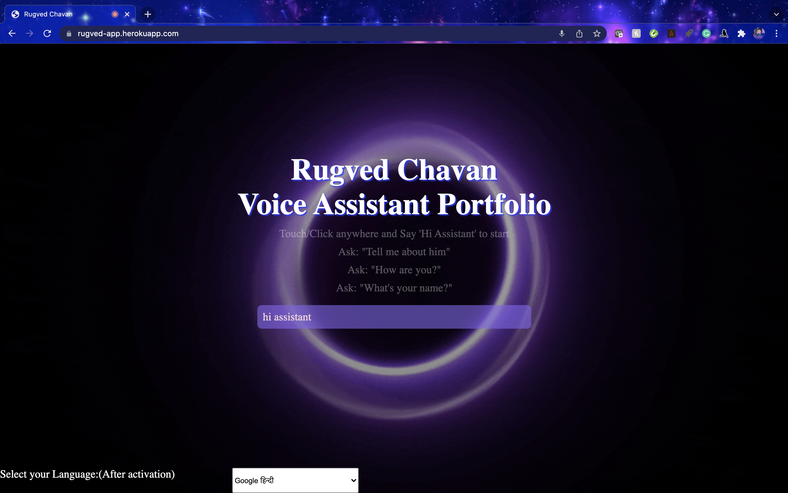

# Hi there, I'm Rugved Chavan - aka [Jarvis08][website] 👋

## Please Cheack out my website. 

----

## As a highly motivated individual with a passion for Artificial Intelligence, Machine Learning, Internet of Things, and Robotics, I am eager to bring my technical skills and ability to provide optimized solutions to real-world problems to a dynamic and challenging environment.
## I have three design patents (published) and a high-impact factor journal paper to my credit. I have completed my internships in major companies like Mahindra, and Bristlecone Inc and as well as an academic internship at the National University of Singapore. I am now seeking the opportunity to further my career as an IT Professional Intern and am eager to contribute to a company that values hard work and offers opportunities for growth.

## My expertise extends across multiple interdisciplinary fields, including Artificial Intelligence, 3D design, web development, and automobiles. My research interests are diverse and encompass Data Science, Internet of Things, Internet of Medical Things, Industry 4.0, Robotics, and Machine Learning.

---

 

---
<ul align="center">
<li>🌱 I’m currently learning everything 🤣</li>
<li> 👯 I’m looking to collaborate with other research scholars </li>
<li> 🥅 2022 Goals: Contribute more in the field of research and development </li>
<li> ⚡ Fun fact: For me coding is like art. Providing optimized solutions with creativity. </li>
</ul>
### Connect with me:

[][website]
[][youtube]
[][twitter]
[][linkedin]
[][instagram]

 

### Languages and Tools:

[][webdevplaylist]
[][webdevplaylist]
[][cssplaylist]
[][cssplaylist]
[][webdevplaylist]
[][webdevplaylist]
[][webdevplaylist]
[][webdevplaylist]
[][webdevplaylist]
[][webdevplaylist]

 
 

---

## Stats:

    

<!--   https://activity-graph.herokuapp.com/graph?username=ctrl-gaurav&theme=react-dark&bg_color=20232a -->
<!--   theme=jolly&hide_border=true -->

    
  </a>

    
  </a>

    
  </a>

---
### 📺 Latest YouTube Videos

<!-- YOUTUBE:START -->
- [Robot Design | Cozmo Robot imitation | Forklift design Fusion 360](https://www.youtube.com/watch?v=Zsgi15xlaz4)
- [Face Tracing Robot using Raspberry Pi | OpenCV | Computer Vision | Fusion 360](https://www.youtube.com/watch?v=jaQxsuHskcA)
- [Google Voice Assistant on Raspberry Pi with custom commands and GPIO control](https://www.youtube.com/watch?v=czCzjse3aYU)
- [How to design Complete Drone || Fusion 360 Design || Raspberry Pi4 Extension](https://www.youtube.com/watch?v=WWXdS_8P8mI)
- [The Robotic AI Arm Trailer || Raspberry pi project || Fusion 360 || Prototype](https://www.youtube.com/watch?v=E4nQwieZy8k)
<!-- YOUTUBE:END -->

➡️ [more videos...](https://youtube.com/codestackr)

----
# Projects:

Public Repo
> Project 1: Robot tracking via central monitoring system.

  

----

Private Repos
<!--
> Project 2: Smart AI Glasses (IoT, Computer Vision, Fusion 360)

[][website]

Looking at the future trend we have designed Smart AI Glasses that can be commercialized or can be used in a highly restricted area for securing the area from untheorized identity. Features of our smart glasses are smart notifications, navigation assistance, a Health monitoring system, identity detections. The main motive of our project is to launch these glasses at an affordable price with high reliability.
-->

----

> Project 3: Plant Health Monitoring System. (IoT, Data Science, Web Dev)

[][website]
System will Monitor Soil moisture and light intensity in real-time using moisture sensor and intensity sensor and their adjust to the levels suitable for plant. You can access all the parameters remotely.

> Project 4: EnBioMatric.in (Flask, HTML, CSS)

[][website]

----

> Project 5: Universal Diseases Screening System (UDSS). (ML, Frontend, Flask)

This project aims to bring Universal Diseases Screening System to all citizens. This project is envisaged to bring all the medical records and history to one common platform. So that proper diagnosis of the illness is achieved with very little or no trouble. we are using Deep Learning and Machine Learning algorithms to detect and diagnose diseases based on lab reports. User can upload Chest X-ray Images/CT-Scan to detect Covid-19, Pneunmonia or Brain Tumor.

----

> Project 6: Restaurant Management System (Frontend, Mysql, Node.js)

[][website]
Restaurant Management System was designed for managing customer names, bills, time of transactions and available food items. This system will get installed on the restaurant counter by giving a user interface on website. Further to give more analytical data to the owner, system will also provide data like which is the highest selling food item, today's total money collected, this month total money collected etc. Data generated at the database per day is huge, to solve this problem we will be using big data for storage. Further to get predictions about what will be tomorrows total, next month total etc, tensorflow.js is implemented for machine learning algorithms.

----

> Project 7: Multi Featured Robot for home and work automaton (on JARVIS concept) (Computer Vision, NLP, Google Services)

   

----

* Computer Vision Embeded for Owner detection
* Voice Assistance
* Temperature/Humidity/Smoke Sensors with Smart Notifications
* Controls Smart Home Devices like smart lights, fans etc
* R.O.S techonlogy with smart room maping and multiple robot control

----

> Project 8: Smart Dustbin (IoT -Arduino)

* Intelligent Garbage Bin Using Arduino, Ultrasonic Sensor, and Servo Motor
* When a person wants to dispose of trash in a garbage can, the garbage can's lid will open automatically and without human intervention.
* In this Corona pandemic, everything must be contactless, thus we are attempting to create a Smart Dustbin that is contactless.
* This Smart Dustbin detects a person or object using an Ultrasonic Sensor that communicates with a Servo Motor using an Arduino Uno. When a person approaches a Smart Dustbin, the Dustbin Cap will automatically open for waste disposal and then close after a period of time.

----

> Project 9: Voice Assistant Portfolio

- Based on complete HTML, JavaScript & CSS, Python was only used for hosting the site
- A portfolio website includes professional information about an individual or firm, as well as a presentation of the individual's or company's work. In the age of artificial intelligence, I decided to create a portfolio to which we can communicate and which can respond on my behalf. 
- This website's background has a soul-like appearance, giving the impression that you are talking with live technology. I also included the possibility of altering the voice assistant's accent.

- View the webapp on : https://voice-assistant-portfolio.el.r.appspot.com/

 
 

## And Many More... Click here --> 

## Want to know more about me follow me on instagram.

[website]:  https://voice-assistant-portfolio.el.r.appspot.com/
[course]:   https://voice-assistant-portfolio.el.r.appspot.com/
[twitter]: https://twitter.com/rugved88
[youtube]: https://www.youtube.com/channel/UCXXXXWBJXT_bVsKF8sBZDTg
[instagram]: https://www.instagram.com/jarvis_004/
[linkedin]: https://www.linkedin.com/in/rugved-chavan-9a09b3209/
[webdevplaylist]: https://www.youtube.com/channel/UCXXXXWBJXT_bVsKF8sBZDTg
[jsplaylist]: https://www.youtube.com/channel/UCXXXXWBJXT_bVsKF8sBZDTg
[cssplaylist]: https://www.youtube.com/channel/UCXXXXWBJXT_bVsKF8sBZDTg
[reactplaylist]: https://www.youtube.com/channel/UCXXXXWBJXT_bVsKF8sBZDTg
