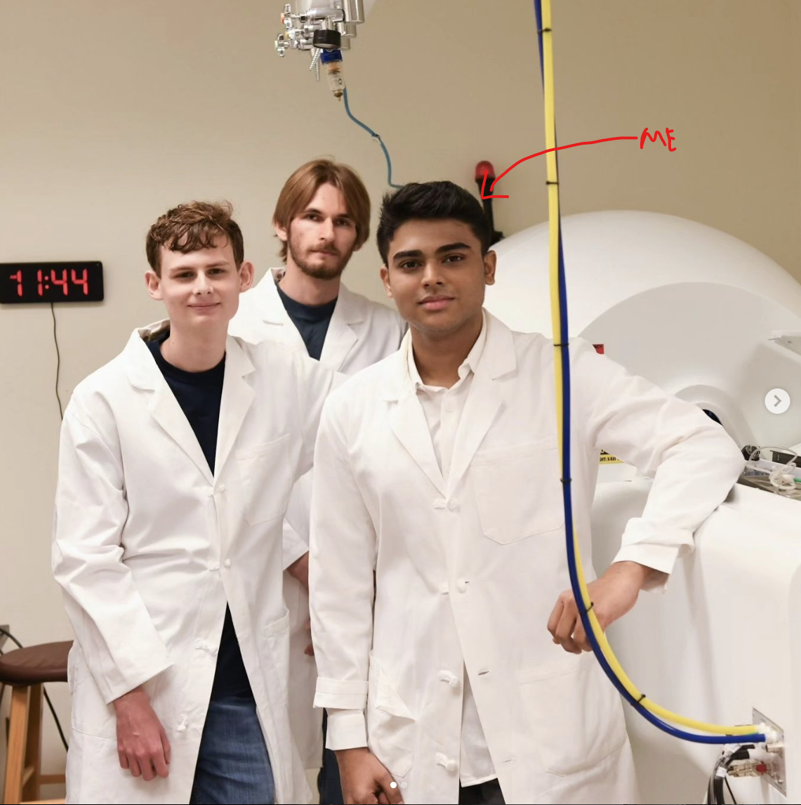

  

# Hi, I'm Rugved Chavan 👋

🚀 Welcome to my GitHub profile! I'm deeply involved in AI, Machine Learning, IoT, Software Development SDE and Robotics, aiming to innovate and solve real-world challenges.
I am Looking for Internships 2024 & Full-time 2025!

🌐 **LinkedIn**: [Rugved's Profile](https://www.linkedin.com/in/rugved-chavan-9a09b3209/)

## About Me
- 🎓 **Education**: MSc in Computer Science, UVA | B.Tech. in Computer & Communication, Manipal University Jaipur.
- 💻 **Experience**: Graduate Research Assistant, UVA | Data Science Intern, SAP | Internships at Bristlecone Inc, NUS.
- 🏅 **Achievements**: Multiple patents, journal/conference papers | 'Best Performer 2022', NUS.
- 🔍 **Expertise**: AI, ML, Software Development, Generative AI in Biomedicine and 3D Design.
- 🔬 **Research Interests**: Machine Learning, AI in Biomedicine Data Science, IoT and Robotics.

## Current Learning & Goals
- 🌱 **Internships 2024 | Full-time 2025**: Seeking challenging opportunities in Software Development SDE, AI, ML, Genrative AI and IoT.
- 👯 **Collaboration**: Keen on working with research scholars and tech professionals.

## Connect with Me

- Mail : rugvedm12@gmail.com
- [LinkedIn](https://www.linkedin.com/in/rugved-chavan-9a09b3209/)
- [YouTube](https://www.youtube.com/channel/UCXXXXWBJXT_bVsKF8sBZDTg)
- [Instagram](https://www.instagram.com/jarvis_004/)

## Recent Research Publications

Here are some of my latest research papers:

1. **[KUB-UNet: segmentation of organs of urinary system from a KUB X-ray image](https://scholar.google.com/citations?view_op=view_citation&hl=en&user=Uyae7NoAAAAJ&citation_for_view=Uyae7NoAAAAJ:u-x6o8ySG0sC)** - This study introduces KUB-UNet, a novel AI model for segmenting urinary system organs in KUB X-ray images. It addresses the underexplored area of kidney, ureter, and bladder segmentation, leveraging a unique dataset and enhancing diagnostic accuracy.

2. **[Forecasting of mobile network traffic and spatio–temporal analysis using modLSTM](https://scholar.google.com/citations?view_op=view_citation&hl=en&user=Uyae7NoAAAAJ&citation_for_view=Uyae7NoAAAAJ:UeHWp8X0CEIC)** - This paper presents a modified LSTM model for predicting mobile network traffic. It significantly improves forecast accuracy and efficiency compared to traditional models, showcasing potential for real-time network traffic management and decision-making.

3. **[CrowdDCNN: Deep convolution neural network for real-time crowd counting on IoT edge](https://www.sciencedirect.com/science/article/abs/pii/S0952197623012733)** - The paper proposes CrowdDCNN, an advanced neural network model for real-time crowd counting. It notably reduces mean square error and model size, making it suitable for low-computation devices, and introduces the 'NoLag' algorithm for efficient live crowd counting.

For more of my publications, visit my [Google Scholar profile](https://scholar.google.com/citations?user=Uyae7NoAAAAJ&hl=en).

## Featured Projects

### 1. [Fast-Processing Bi-Modal Large Language (LLM) and Vision Model](https://github.com/rugved88/Bi-Modalities-Large-Language-Model-Text-Image-)
**Challenge:** Enhancing AI's multimodal processing abilities, focusing on text and image modalities.  
**Objective Achieved:** Developed a bi-modal model using CLIP, GPT-3 LLM, and custom synchronization algorithm for content generation across text and image modalities, improving content quality and inference time.

### 2. [Graph-Based Optimization for Controlling and Monitoring Multiple Delivery Robots via External Camera](https://github.com/rugved88/Robot-tracking-via-central-monitoring-system)
**Challenge:** Efficiently controlling and monitoring delivery robots to minimize delivery time and cost.  
**Objective Achieved:** Implemented a hybrid BFS algorithm in robots for optimal pathfinding, utilized TCP for real-time instruction transmission, and employed computer vision for grid detection.

### 3. [Dynamic Display Adjustments: Using Real-time User Positioning and Eye Monitoring for Optimal Screen Settings](https://www.youtube.com/watch?v=4bUi90hpe7w)
**Challenge:** The primary challenge addressed in this research is the static nature of laptop display settings, which fail to adapt to varying user proximity, position, and application requirements. This oversight in Human-Computer Interaction (HCI) leads to suboptimal user experiences and can potentially affect ocular well-being.  
**Objective Achieved:** 
1. Dynamic Adaptation: Utilize the laptop's camera for real-time adjustment of display settings based on user distance and orientation, enhancing user experience.
2. Ocular Health Focus: Monitor visual strain symptoms to adjust screen settings, such as blue light filtration, for improved eye comfort and well-being.
3. Automated User-Centric Modes: Implement template-based configurations like "Research Mode" for optimized and personalized digital workspace setup.

### 4. [Plant Health Monitoring System](https://www.youtube.com/watch?v=vZWT_qV5Bj4)
**Challenge:** Real-time monitoring and adjustment of environmental conditions for optimal plant health.  
**Objective Achieved:** Created a system to monitor soil moisture and light intensity, adjusting levels as needed for plant health, with remote access to data.

<!-- ### 5. [EnBioMatric.in](http://enbiomatric.in)
**Challenge:** [Brief description of the challenge]  
**Objective Achieved:** [Brief summary of the objectives achieved] -->

<!-- ### 5. [Universal Diseases Screening System](https://github.com/rugved88/Restaurant-app1)
**Challenge:** Create a Data  
**Objective Achieved:** [Brief summary of the objectives achieved] -->

### 5. [Restaurant Management System](#)
**Challenge:** Create a Relational Data Base Management Project using SQL and NodeJS  
**Objective Achieved:** This system is a comprehensive solution for managing restaurant operations, including tracking customer names, bills, transaction times, and food item availability. Designed for installation at restaurant counters, it features a user-friendly web interface. The system provides valuable analytics, such as identifying the highest selling food items and summarizing daily and monthly revenue. To handle the vast amount of data generated, we employ big data storage techniques. Additionally, we leverage TensorFlow.js for machine learning algorithms to forecast future sales trends, like predicting the next day's or month's revenue. This approach enhances operational efficiency and decision-making for restaurant owners.

### 6. [Multi-Featured Home and Work Automation Robot](https://www.youtube.com/watch?v=jaQxsuHskcA)
**Objective Achieved:** In this project, we developed a sophisticated smart home automation system that combines computer vision for owner detection, voice assistance, and environmental sensors (temperature, humidity, smoke) with smart notifications. The system enables control of smart home devices like lights and fans through a user-friendly interface. Leveraging the Robot Operating System (ROS) for intelligent room mapping and multi-robot coordination, it also includes a DIY 4WD face-tracking robot powered by Raspberry Pi, OpenCV, and Fusion 360. This integrated approach results in a secure, efficient, and interactive smart home experience.

  

### 7. [Smart Dustbin](#)
**Challenge:** Creating a contactless, intelligent waste disposal system.  
**Objective Achieved:** Developed a Smart Dustbin using Arduino and Ultrasonic Sensors for contactless operation, enhancing hygiene and convenience.

### 8. [Voice Assistant Portfolio](https://voice-assistant-portfolio.el.r.appspot.com/)
**Challenge:** Designing an interactive and AI-integrated personal portfolio website.  
**Objective Achieved:** Created a responsive portfolio website with an AI voice assistant, offering a unique and engaging user experience.

 />
 

### 📺 Latest YouTube Videos

- [Fast-Processing Bi-Modal Large Language and Vision Model](https://www.youtube.com/watch?v=bDb0FkX1tLI)
- [Face Tracing Robot using Raspberry Pi | OpenCV | Computer Vision | Fusion 360](https://www.youtube.com/watch?v=jaQxsuHskcA)
- [More Videos...](https://youtube.com/codestackr)

## Languages and Tools

- Python, C, HTML5, CSS3, Flask, Node.js, SQL, MySQL, Git, GitHub, Fusion360

## My GitHub Stats

<!--  -->

---

**Want to know more? Follow me on [Instagram](https://www.instagram.com/jarvis_004/).**
